# Safe Routes - Firestore Schema Design

## Firestore Overview

Safe Routes helps urban runners and cyclists discover safer roads, well-lit paths, and community-verified routes in busy cities. This document defines the Firestore schema that the team will use before implementing full CRUD logic.

The schema is designed for:
- scalable reads and writes
- clear ownership of data per collection
- minimal nesting and predictable query patterns

## Data Requirements List

The app must store:
- users and profile preferences
- routes with map path metadata
- route reviews and ratings
- safety reports for hazards, lighting, and traffic issues
- route verifications from trusted community users
- user notifications
- user bookmarks (saved routes)

## Firestore Data Model

### 1) `users`
Document ID: `userId` (Firebase Auth UID recommended)

Fields:
- `name`: string
- `email`: string
- `photoUrl`: string?
- `preferences`: map
- `createdAt`: timestamp
- `updatedAt`: timestamp

Subcollections:
- `bookmarks`
  - Document ID: auto ID
  - `routeId`: string
  - `savedAt`: timestamp

### 2) `routes`
Document ID: `routeId` (auto ID)

Fields:
- `name`: string
- `description`: string
- `createdBy`: string (`users/{userId}` reference ID)
- `city`: string
- `distanceKm`: number
- `path`: array<GeoPoint>
- `avgRating`: number
- `isVerified`: boolean
- `createdAt`: timestamp
- `updatedAt`: timestamp

Subcollections:
- `reviews`
  - Document ID: `reviewId` (auto ID)
  - `userId`: string
  - `rating`: number
  - `comment`: string
  - `createdAt`: timestamp
- `safetyReports`
  - Document ID: `reportId` (auto ID)
  - `userId`: string
  - `type`: string (`lighting`, `traffic`, `incident`, `other`)
  - `description`: string
  - `location`: GeoPoint
  - `reportedAt`: timestamp
  - `upvotes`: number
  - `downvotes`: number
- `verifications`
  - Document ID: `verificationId` (auto ID)
  - `userId`: string
  - `verifiedAt`: timestamp

### 3) `notifications`
Document ID: `notificationId` (auto ID)

Fields:
- `userId`: string
- `title`: string
- `body`: string
- `isRead`: boolean
- `createdAt`: timestamp

## Why Subcollections Were Used

Subcollections are used for `reviews`, `safetyReports`, `verifications`, and `bookmarks` because these datasets grow continuously and should be read independently from their parent documents. This avoids large arrays in parent documents and improves scalability and query flexibility.

## Naming and Structuring Conventions

- field names use lowerCamelCase
- all mutable records include `createdAt` and `updatedAt` where applicable
- document structures are flat and query-friendly
- auto IDs are preferred except where stable IDs are meaningful (for example `userId` from Auth)

## Schema Diagram (Mermaid)

```mermaid
flowchart TD
  users[[users]] --> userDoc[(userId)]
  userDoc --> u1[name: string]
  userDoc --> u2[email: string]
  userDoc --> u3[photoUrl: string?]
  userDoc --> u4[preferences: map]
  userDoc --> u5[createdAt: timestamp]
  userDoc --> u6[updatedAt: timestamp]

  userDoc --> bookmarks[[bookmarks]]
  bookmarks --> bookmarkDoc[(bookmarkId)]
  bookmarkDoc --> b1[routeId: string]
  bookmarkDoc --> b2[savedAt: timestamp]

  routes[[routes]] --> routeDoc[(routeId)]
  routeDoc --> r1[name: string]
  routeDoc --> r2[description: string]
  routeDoc --> r3[createdBy: string]
  routeDoc --> r4[city: string]
  routeDoc --> r5[distanceKm: number]
  routeDoc --> r6[path: array<GeoPoint>]
  routeDoc --> r7[avgRating: number]
  routeDoc --> r8[isVerified: boolean]
  routeDoc --> r9[createdAt: timestamp]
  routeDoc --> r10[updatedAt: timestamp]

  routeDoc --> reviews[[reviews]]
  reviews --> reviewDoc[(reviewId)]
  reviewDoc --> rv1[userId: string]
  reviewDoc --> rv2[rating: number]
  reviewDoc --> rv3[comment: string]
  reviewDoc --> rv4[createdAt: timestamp]

  routeDoc --> safetyReports[[safetyReports]]
  safetyReports --> reportDoc[(reportId)]
  reportDoc --> s1[userId: string]
  reportDoc --> s2[type: string]
  reportDoc --> s3[description: string]
  reportDoc --> s4[location: GeoPoint]
  reportDoc --> s5[reportedAt: timestamp]
  reportDoc --> s6[upvotes: number]
  reportDoc --> s7[downvotes: number]

  routeDoc --> verifications[[verifications]]
  verifications --> verDoc[(verificationId)]
  verDoc --> v1[userId: string]
  verDoc --> v2[verifiedAt: timestamp]

  notifications[[notifications]] --> notifDoc[(notificationId)]
  notifDoc --> n1[userId: string]
  notifDoc --> n2[title: string]
  notifDoc --> n3[body: string]
  notifDoc --> n4[isRead: boolean]
  notifDoc --> n5[createdAt: timestamp]
```



## Sample Firestore Documents

### users/user_123

```json
{
  "name": "Ravi Kumar",
  "email": "ravi@example.com",
  "photoUrl": "https://example.com/ravi.jpg",
  "preferences": {
    "preferredActivity": "running",
    "preferredTime": "earlyMorning",
    "avoidHighTraffic": true
  },
  "createdAt": "2026-03-09T08:00:00Z",
  "updatedAt": "2026-03-09T08:00:00Z"
}
```

### routes/route_abc

```json
{
  "name": "Lakefront Sunrise Loop",
  "description": "Well-lit 6km loop with low traffic in the early morning.",
  "createdBy": "user_123",
  "city": "Bengaluru",
  "distanceKm": 6.0,
  "path": [
    {"lat": 12.9721, "lng": 77.5933},
    {"lat": 12.9708, "lng": 77.5999}
  ],
  "avgRating": 4.6,
  "isVerified": true,
  "createdAt": "2026-03-09T08:10:00Z",
  "updatedAt": "2026-03-09T08:10:00Z"
}
```

### routes/route_abc/reviews/review_1

```json
{
  "userId": "user_456",
  "rating": 5,
  "comment": "Good lighting and safe intersections.",
  "createdAt": "2026-03-09T09:00:00Z"
}
```

### routes/route_abc/safetyReports/report_1

```json
{
  "userId": "user_789",
  "type": "lighting",
  "description": "One broken light pole near the north gate.",
  "location": {"lat": 12.9715, "lng": 77.5964},
  "reportedAt": "2026-03-09T09:15:00Z",
  "upvotes": 4,
  "downvotes": 0
}
```

### notifications/notif_1

```json
{
  "userId": "user_123",
  "title": "Safety update on saved route",
  "body": "A lighting issue was reported on Lakefront Sunrise Loop.",
  "isRead": false,
  "createdAt": "2026-03-09T09:30:00Z"
}
```

## Data Flow Summary

- users create and update `routes`
- community users add `reviews` and `safetyReports` to routes
- trusted users add route-level `verifications`
- users store saved routes in `users/{userId}/bookmarks`
- backend writes user alerts into `notifications`

## Reflection

### Why this structure

This schema keeps each collection focused on one responsibility. High-growth items are isolated into subcollections to support efficient pagination and filtered reads.

### How it supports scalability and clarity

- parent documents stay lightweight
- query paths are explicit and predictable
- team members can reason about ownership and access rules per collection

### Challenges during design

The key tradeoff was deciding what to denormalize while preserving write simplicity. Route-level summary fields (for example `avgRating`) are stored in the parent route document while detailed, growing data remains in subcollections.

## Commit and PR Template

Commit message:
- `feat: added Firestore schema design and database architecture diagram`

PR title:
- `[Sprint-2] Firestore Schema Design - TeamName`

PR description should include:
- schema details
- visual diagram
- explanation of data flow
- reflection
