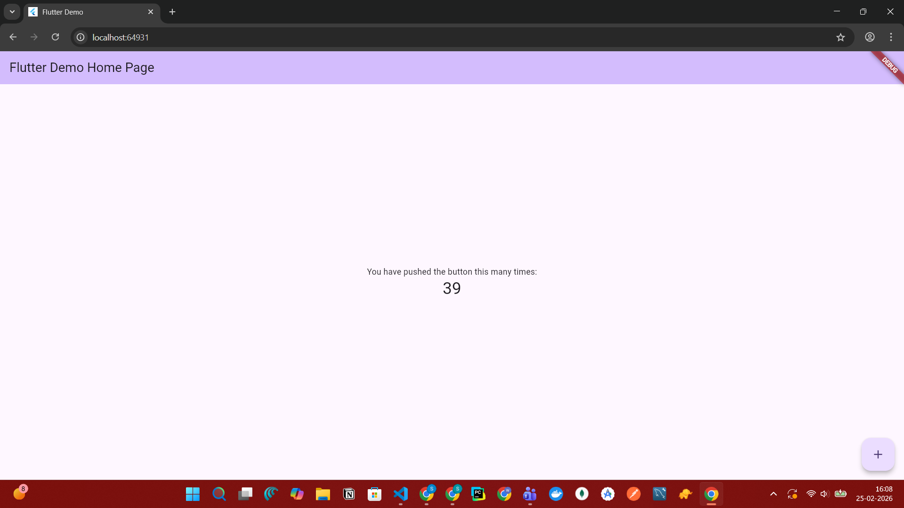
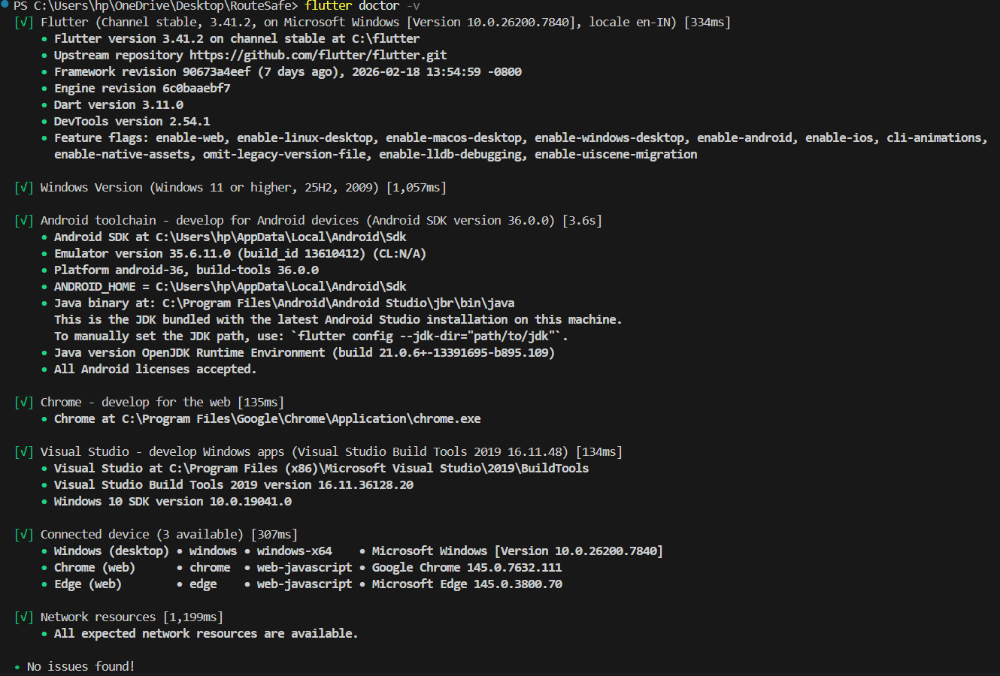

🚀 Safe Route
Sprint #2 – Flutter Environment Setup & First App Run

This module marks the foundational setup for Sprint #2: Building Smart Mobile Experiences with Flutter & Firebase.

The goal of this task was to configure a complete Flutter development environment, verify installation, and successfully run the first Flutter application on an emulator or physical device.

A stable setup ensures smooth integration with Firebase, Google Maps, and advanced Flutter modules in upcoming phases.

📌 Project Title

Flutter Environment Setup and First App Run

🛠️ Installation & Configuration Steps
1️⃣ Installed Flutter SDK

Downloaded Flutter SDK from the official Flutter website.

Extracted to a dedicated directory:

Windows: C:\src\flutter

macOS/Linux: ~/development/flutter

Added Flutter to system PATH environment variable.

Verified installation using:

flutter doctor

Ensured all required dependencies were resolved.

2️⃣ Set Up Development Environment
Option A – Android Studio

Installed Android Studio.

Installed required components:

Android SDK

Android SDK Platform

Android Virtual Device (AVD) Manager

Installed Flutter and Dart plugins.

Option B – VS Code

Installed Flutter extension.

Installed Dart extension.

3️⃣ Emulator Configuration

Opened AVD Manager in Android Studio.

Created a virtual device (Pixel 6 recommended).

Selected Android 13+ system image.

Launched emulator successfully.

Verified emulator detection using:

flutter devices
4️⃣ Created and Ran First Flutter App

Created project:

flutter create safe_route
cd safe_route
flutter run

Successfully launched default Flutter counter application on emulator.

✅ Setup Verification
🔹 Flutter Doctor Output

📸 screenshot here showing all green checks

Example:

[✓] Flutter
[✓] Android toolchain
[✓] Chrome
[✓] Android Studio
[✓] VS Code
🔹 App Running on Emulator

📸 Add screenshot here showing default Flutter counter app

🧠 Reflection
Challenges Faced

Resolving Android SDK path configuration.

Accepting Android licenses using flutter doctor --android-licenses.

Ensuring PATH variables were correctly set.

Key Learnings

A properly configured environment prevents future build and dependency issues.

flutter doctor is essential for diagnosing setup problems.

Emulator configuration is critical for consistent mobile testing.

How This Prepares Us for Sprint #2

This setup enables:

Flutter UI development

Firebase integration

Google Maps SDK usage

Real-time testing on emulator

Efficient debugging using DevTools

With the environment verified, we are ready to begin building core modules including authentication, Firestore integration, and map-based route discovery.

📂 Branch & PR Details

Branch Name:

setup/flutter-environment

Commit Message:

setup: completed Flutter SDK installation and first emulator run

Pull Request Title:

[Sprint-2] Flutter Environment Setup – TeamName